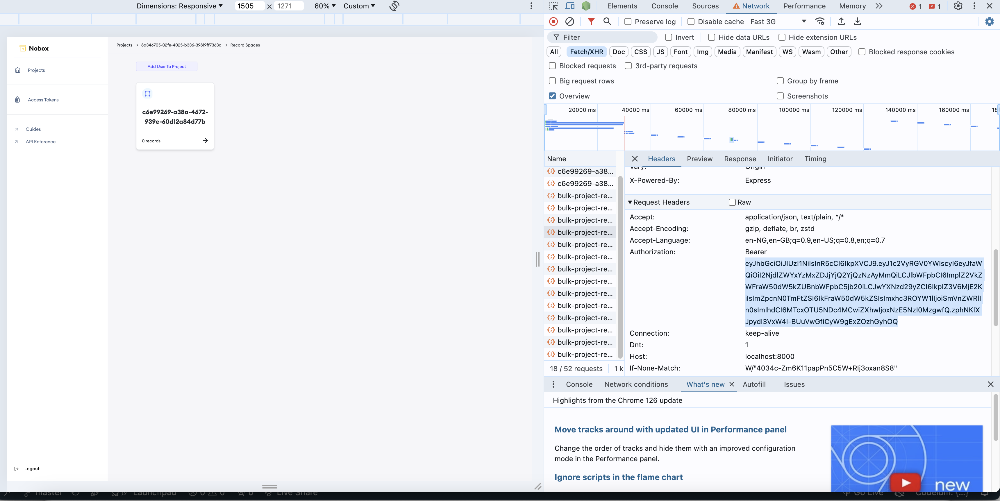

## Description
Nobox-core is an engine that powers the possibility of autogenerated endpoints. It means with Nobox-core running, you can create endless CRUD endpoints from any app that can make HTTP connections, this includes Browser App websites, backend servers, apps, IOT devices etc.

## Philosophy
We want to cut out every second that isn't worth spending on repetitive tasks while building products. We are not close to doing 10% of what we choose to accomplish but we have taken the first step and that is something.

>> **Notice:** Soon, we will be releasing documentation on how to connect directly to Nobox Core without the need for a JS client. This makes it endlessly possible to connect any software to Nobox. By the way, the "easy-to-read" codebase makes it plain to understand how to.

## Installation
There are three ways of working with Nobox:
- Watch the Installation Video
- Follow the Local Installation Steps Below
- Use the Online PlayGround.

  
### 1)  Watch the Installation Video

### 2) Local Installation
-  Clone `git clone https://github.com/nobox-org/nobox-core.git`
-  Enter cloned dir: `cd nobox-core`
-  Rename env file: `mv env/.example.env env/.local.env`
-  Install Nobox:
    - On Mac/Windows: `npm install`
    - On Linux: `npm run install:nobox-on-linux`
-  Start local Mongo Replica using docker: `npm run setup:mongo-replica`
-  Run: `npm run dev`
- Run [Nobox Dashboard](https://github.com/nobox-org/nobox-console)
- Connect Your Client following docs [here](https://www.docs.nobox.cloud/integrate-nobox)

### 3) Use the Online PlayGround.
- follow the docs [here](https://docs.nobox.cloud)

## Testing
E2E tests are quite flaky.

To make it work, 
- update `gatewayHeadersWithAuthorization` with a new authorization token, you can copy this from the dashboard request being made , just check the network tab in your browser while making request

-  update `authorizationHeaderObject` with the access token on the dashboard
- then you also need to change all `views` related test by getting an existing projectId and recordSpaceId, then replace it with the hardcoded ids in the axios url e.g. this `await axiosInstance.get(`/views/667eef5a6225c758ec290f6a/667eef5a6225c758ec290f6b`);` will turn to this `await axiosInstance.get(`/views/667eef5a6225c758ec290f76/667eef2b31d2cb46b437022e`);`
